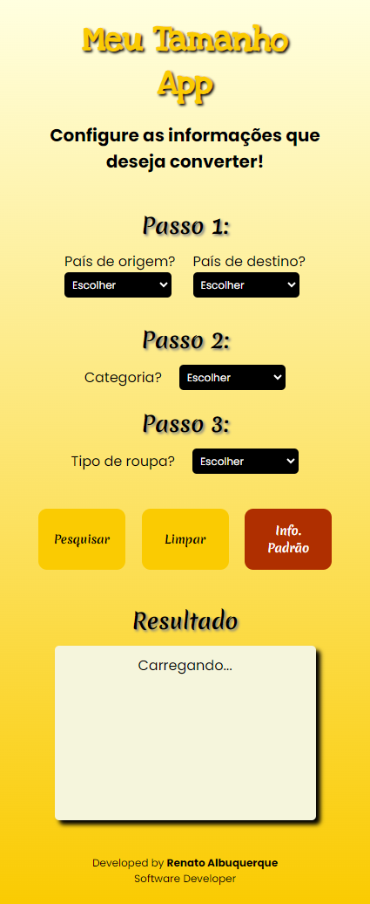

# My Size App | Clothing Measurement Converter

Responsive project, mobile first, developed in HTML, CSS and JavaScript.
Developed in November, 2023.

## Table of contents

- [Overview](#overview)
  - [The challenge](#the-challenge)
  - [Screenshot](#screenshot)
  - [Links](#links)
- [My process](#my-process)
  - [Built with](#built-with)
- [Author](#author)

## Overview

### The challenge

Users should be able to:

- View the optimal layout for the site depending on their device's screen size (Developed for the breakpoints: 375px, 425px, 768px, 1024px, 1440px)
- Set up the information you want to convert by: Country of origin and Country of destiny, Category (Male, Female and Children), Type of clothing (Shirt, Pants, Shoe)
- See the information requested in the result field
- See the alert message in the result field
- See alert messages in the country selection fields

### Screenshot

### Links

- [Solution URL here](https://github.com/renato-albuquerque/mysize-converter)
- [Live Site URL here](https://meu-tamanho-app.vercel.app/)

## My process

### Built with

- Semantic HTML5 markup
- CSS custom properties
- Flexbox
- JavaScript
- Mobile-first workflow

## Author

- Business Card - [Renato Albuquerque](https://rma-contacts.vercel.app/)
- Linkedin - [renato-malbuquerque](https://www.linkedin.com/in/renato-malbuquerque/)
- Discord - [Renato Albuquerque#0025](https://discordapp.com/users/992621595547938837)

